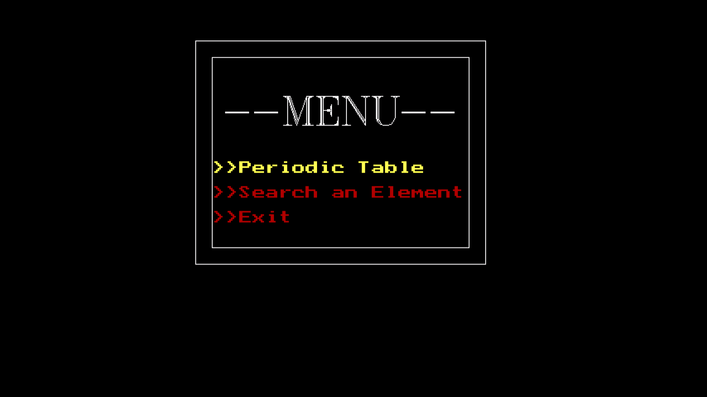
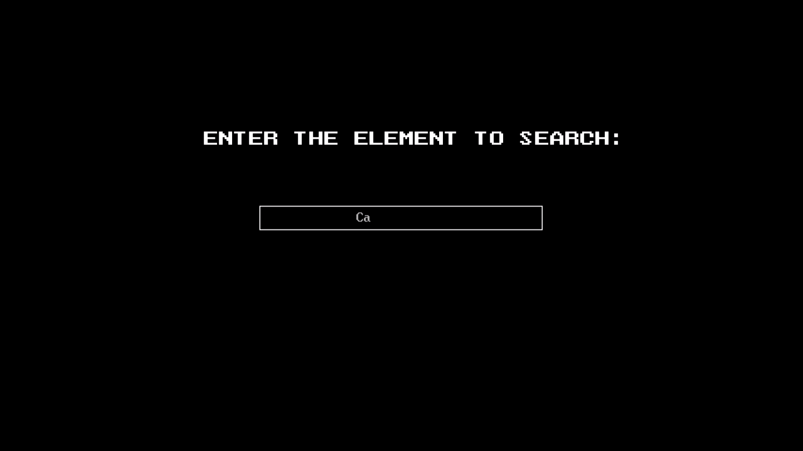
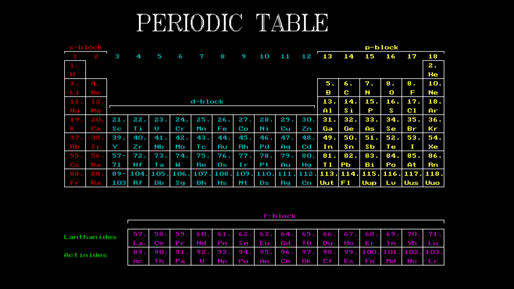

# C-Table
This is a programme made on C++ for showing Periodic Table, searching about an element on it.

## ScreenShots
## Menu

Use `W` and `S` to navigate up and down respectively. Use enter to select the option.

## Search Element

The search requires an EL.DAT file for the saved elements and they are displayed accordingly.

## Periodic Table

